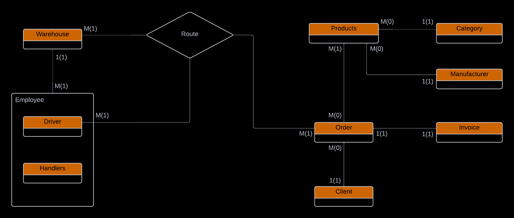
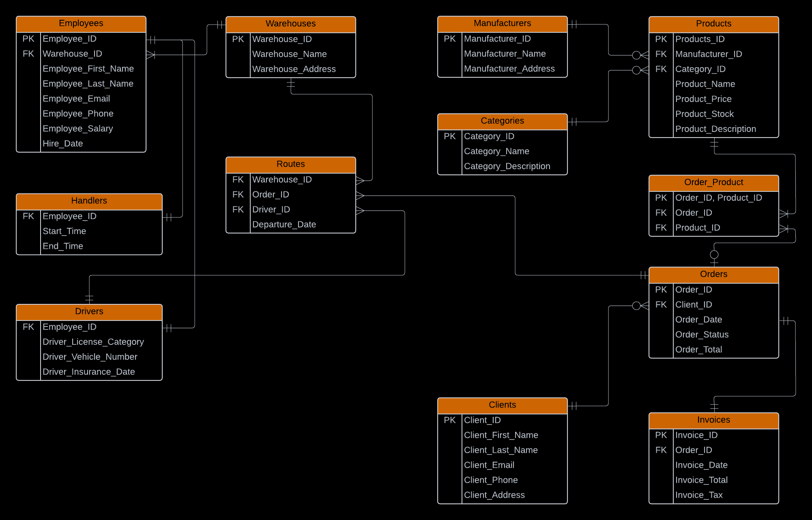
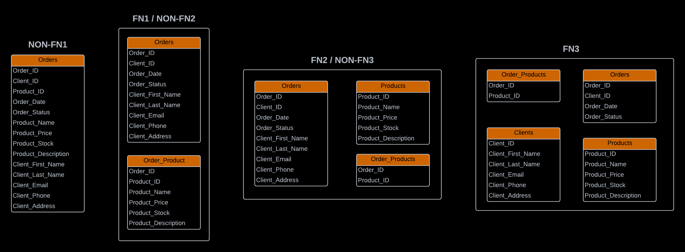
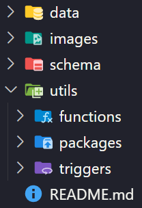

# GoShip Database

## Description

The GoShip database is designed to manage the operations of a distribution company, GoShip, which specializes in handling and transporting product orders. Acting as an intermediary between producers and customers, GoShip utilizes warehouses to facilitate efficient logistics.

The database is implemented using **Oracle SQL** and **PL/SQL** and captures detailed information about products, categories, orders, customers, producers, employees, and routes. This repository includes all necessary scripts and resources to create, populate, and interact with the database.

### Key Features

- **Product Management:** Organizes products by categories and associates them with producers.
- **Order Management:** Tracks orders placed by customers, with each order associated with an invoice and multiple products.
- **Employee Roles:** Distinguishes between two types of employees:
  - **Handlers:** Responsible for loading and unloading products.
  - **Drivers:** Manage transportation of orders.
- **Route Tracking:** Defines delivery routes linking warehouses and customer locations, with assigned drivers.
- **Invoice Generation:** Supports invoice creation for all placed orders.

### Diagrams

- **Entity-Relationship Diagram:**
  
- **Conceptual Model:**
  
- **Normalization Process:**
  

## Repository Structure

## Usage Instructions

1. **Set up the Database:**
   - Install Oracle Database (if not already installed).
   - Use a SQL client such as Oracle SQL Developer.
2. **Create the Schema:**
   - Navigate to the `schema/` folder and run `sequences.sql` and `create_tables.sql`.
3. **Insert Sample Data:**
   - Run `insert_data.sql` from the `data/` folder to populate the database with sample records.
4. **Add Procedures and Functions:**
   - Run scripts in `utils/` to add procedures, functions, triggers and packages.
